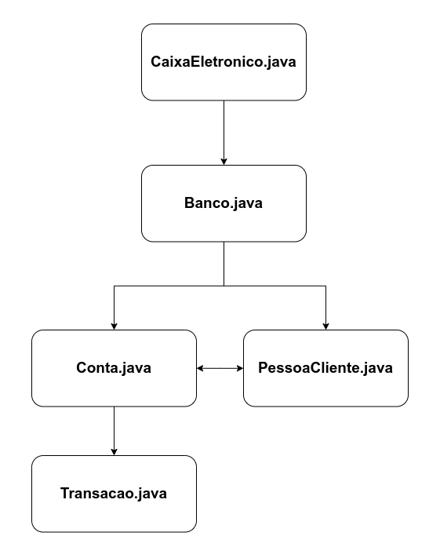
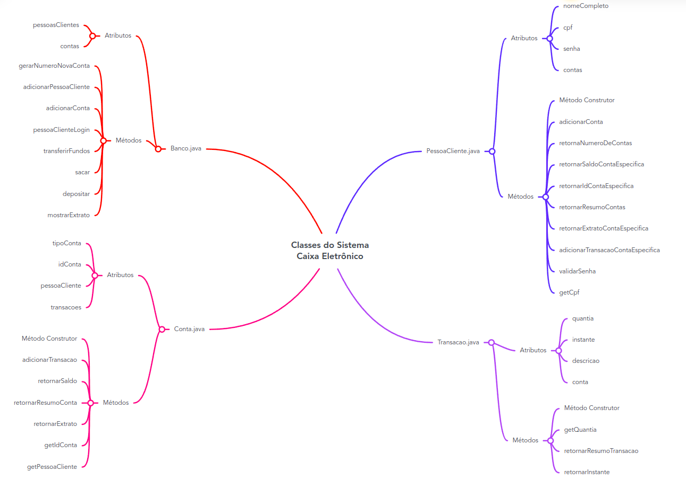

# Caixa Eletrônico

Boas-vindas ao repositório do exercício Caixa Eletrônico

Para realizar o exercício, atente-se a cada passo descrito a seguir e se tiver **qualquer dúvida**, nos envie no _Slack_ da turma! #vqv 🚀

Aqui, você vai encontrar os detalhes de como estruturar o desenvolvimento do seu exercício a partir desse repositório, utilizando uma branch específica e um _Pull Request_ para colocar seus códigos.

## Termos e acordos
Ao iniciar este exercício, você concorda com as diretrizes do [Código de Conduta e do Manual da Pessoa Estudante da Trybe](https://app.betrybe.com/learn/student-manual/codigo-de-conduta-da-pessoa-estudante).

## Entregáveis

<details>
  <summary>🤷🏽‍♀️ Como entregar</summary><br />

Para entregar o seu exercício, você deverá criar um _Pull Request_ neste repositório.

Lembre-se que você pode consultar nosso conteúdo sobre [Git & GitHub](https://app.betrybe.com/learn/course/5e938f69-6e32-43b3-9685-c936530fd326/module/fc998c60-386e-46bc-83ca-4269beb17e17/section/fe827a71-3222-4b4d-a66f-ed98e09961af/day/1a530297-e176-4c79-8ed9-291ae2950540/lesson/2b2edce7-9c49-4907-92a2-aa571f823b79) e nosso [Blog - Git & GitHub](https://blog.betrybe.com/tecnologia/git-e-github/) sempre que precisar!
</details>

<details>
  <summary>👨‍💻 O que deverá ser desenvolvido</summary><br />

O dia a dia de uma pessoa desenvolvedora é repleto de demandas e aqui não será diferente! Chegou a sua vez de desenvolver os testes para um sistema de caixa eletrônico! 💰😮 Mas calma...antes de começar veja todos os critérios que o sistema deve ter para permitir que a pessoa cliente possa: 

- Logar no sistema;

- Visualizar e manipular as informações da sua conta bancária;

- Ter acesso a todas as transações feitas.

Os testes estão descritos abaixo.

</details>

<details>
  <summary><strong>📝 Habilidades a serem trabalhadas</strong></summary>

Neste exercício, verificamos se você é capaz de:

Utilizar conceitos de testes unitários para criar classes em Java.

</details>

## Orientações

<details>

   <summary><strong>‼ Antes de começar a desenvolver </strong></summary>

1. Clone o repositório

- Use o comando: `git clone <url do repositório>`
- Entre na pasta do repositório que você acabou de clonar:
    - `cd <nome do repositório>`

2. Instale as dependências

    - `mvn install`  

3. Crie uma branch a partir da branch `main`

- Verifique que você está na branch `main`
    - Exemplo: `git branch`
- Se você não estiver, mude para a branch `main`
    - Exemplo: `git checkout main`
- Agora, crie uma branch à qual você vai submeter os `commits` do seu exercício:
    - Você deve criar uma branch no seguinte formato: `nome-sobrenome-nome-do-exercício`;
    - Exemplo: `git checkout -b maria-soares-lessons-learned`

4. Crie na raiz do exercício os arquivos que você precisará desenvolver:

- Verifique que você está na raiz do exercício:
    - Exemplo: `pwd` -> o retorno vai ser algo tipo _/Users/maria/code/**sd-0x-project-lessons-learned**_
- Crie os arquivos index.html e style.css:
    - Exemplo: `touch index.html style.css`

5. Adicione as mudanças ao _stage_ do Git e faça um `commit`

- Verifique que as mudanças ainda não estão no _stage_:
    - Exemplo: `git status` (devem aparecer listados os novos arquivos em vermelho)
- Adicione o novo arquivo ao _stage_ do Git:
    - Exemplo:
        - `git add .` (adicionando todas as mudanças - _que estavam em vermelho_ - ao stage do Git)
        - `git status` (devem aparecer listados os arquivos em verde)
- Faça o `commit` inicial:
    - Exemplo:
        - `git commit -m 'iniciando o exercício. VAMOS COM TUDO :rocket:'` (fazendo o primeiro commit)
        - `git status` (deve aparecer uma mensagem tipo _nothing to commit_ )

6. Adicione a sua branch com o novo `commit` ao repositório remoto

- Usando o exemplo anterior: `git push -u origin maria-soares-lessons-learned`

7. Crie um novo `Pull Request` _(PR)_

- Vá até a página de _Pull Requests_ do [repositório no GitHub](https://github.com/tryber/sd-0x-project-lessons-learned/pulls)
    - Clique no botão verde _"New pull request"_
    - Clique na caixa de seleção _"Compare"_ e escolha a sua branch **com atenção**
- Coloque um título para o seu _Pull Request_
    - Exemplo: _"Cria tela de busca"_
- Clique no botão verde _"Create pull request"_

- Adicione uma descrição para o _Pull Request_, um título nítido que o identifique, e clique no botão verde _"Create pull request"_

 

- Volte até a [página de _Pull Requests_ do repositório](https://github.com/tryber/sd-0x-project-lessons-learned/pulls) e confira que o seu _Pull Request_ está criado

</details>

<details>

<summary><strong>⌨️ Durante o desenvolvimento</strong></summary>

Faça `commits` das alterações que você fizer no código regularmente, pois assim você garante visibilidade para o time da Trybe e treina essa prática para o mercado de trabalho :) ;

- Lembre-se de sempre após um (ou alguns) `commits` atualizar o repositório remoto;
- Os comandos que você utilizará com mais frequência são:
    - `git status` _(para verificar o que está em vermelho - fora do stage - e o que está em verde - no stage)_;
    - `git add` _(para adicionar arquivos ao stage do Git)_;
    - `git commit` _(para criar um commit com os arquivos que estão no stage do Git)_;
    - `git push -u origin nome-da-branch` _(para enviar o commit para o repositório remoto na primeira vez que fizer o `push` de uma nova branch)_;
    - `git push` _(para enviar o commit para o repositório remoto após o passo anterior)_.

</details>

<details>
<summary><strong>🎛 Checkstyle</strong></summary>

Para garantir a qualidade do código, vamos utilizar neste exercício o `Checkstyle`. Assim o código estará alinhado com as boas práticas de desenvolvimento, sendo mais legível e de fácil manutenção! Para poder rodar o `Checkstyle` certifique-se de ter executado o comando `mvn install` dentro do repositório.

Para rodá-los localmente no repositório, execute os comandos abaixo:

```bash
mvn checkstyle:check
```

Se a análise do `Checkstyle` encontrar problemas no seu código, tais problemas serão mostrados no seu terminal. Se não houver problema no seu código, nada será impresso no seu terminal.

Você pode também instalar o plugin do `Checkstyle` na sua `IDE`. Para isso, volte na primeira seção do conteúdo.

⚠️ **PULL REQUESTS COM ISSUES NO `Checkstyle` NÃO SERÃO AVALIADAS. ATENTE-SE PARA RESOLVÊ-LAS ANTES DE FINALIZAR O DESENVOLVIMENTO!** ⚠️

</details>

<details>
<summary><strong>🛠 Testes</strong></summary>

Para executar todos os testes basta rodar o comando:
```bash
mvn test
```

Para executar apenas uma classe de testes:
```bash
mvn test -Dtest="TestClassName"
```

</details>

## Requisitos

Para todos os requisitos, iremos implementar os testes unitários, e depois iremos implementar o código para que nossos testes passem. Se necessário, iremos refatorar o código para deixar cada vez mais limpo.

<details>
    <summary>Entendendo o Sistema</summary>

Caso você tenha alguma dificuldade na implementação do método main, e da criação das classes que compõem o nosso sistema, leia atentamente a estrutura que montamos.



A seguir descrevemos as classes essenciais para o nosso sistema de caixa eletrônico. Vamos juntos nesta jornada, testando e aperfeiçoando a nossa criação. Vamos nessa!

<details>
    <summary>Classe Banco</summary>

- `Banco`: representa a entidade banco do nosso caixa eletrônico. Essa classe é a responsável por criar novas pessoas clientes no banco e também verificar e validar o login da pessoa cliente no caixa eletrônico.
    - Atributos:
        - `pessoasClientes`: esse atributo é um array de objetos da classe `PessoaCliente` (ex: ArrayList<PessoaCliente>), e representa a lista de pessoas clientes que tem contas abertas no banco (uma pessoa cliente pode ter mais de uma conta aberta).
        - `contas`: esse atributo é um array de objetos da classe `Contas` (ex: ArrayList<Conta>) e representa a lista de contas abertas no banco, onde cada uma pertence a uma pessoa cliente. As contas são identificadas por uma String de 10 dígitos, que representa um número identificador único gerado pelo método `gerarNumeroNovaConta` da classe `Banco`.
    
    - Métodos:
        - `gerarNumeroNovaConta`: esse método é público, deve retornar uma String  e não recebe nenhum argumento. Ele é responsável por gerar e retornar uma String de 10 dígitos, que representa o número identificador único de uma conta, ou seja, para cada nova conta aberta, ele deve gerar um número único (ex: "8514540006").         
        - `adicionarPessoaCliente`: esse método é público, retorna um objeto do tipo `PessoaCliente` e deve receber 4 argumentos do tipo String (nome, tipoConta, cpf, e senha). Esse método deve instanciar um objeto da classe `PessoaCliente` e adicioná-lo no array `pessoasClientes`, também deve instanciar um objeto da classe `Conta` e adicioná-lo no array `contas`. Depois disso, deve adicionar essa nova conta à pessoa cliente que acabou de ser criada através do método `adicionarConta` da classe `PessoaCliente`. Por fim, esse método deve retornar esse objeto da classe `PessoaCliente` criado.
        - `adicionarConta`: esse método é público e tem o retorno do tipo `void`, ou seja, não retorna nenhum valor e recebe 1 argumento (novaConta) do tipo `Conta`. Esse método é responsável por receber uma conta como parâmetro e adicionar ao array `contas`.
        - `pessoaClienteLogin`: esse método é público, retorna um objeto do tipo `PessoaCliente` e recebe 2 argumentos do tipo String (cpf e senha). Ele é responsável por buscar no array `pessoasClientes` , o objeto que é dono do cpf passado por parâmetro e verificar se a senha está correta. Caso o cpf e a senha sejam de algum objeto que está no array `pessoasClientes`,  o objeto que representa a pessoa cliente deve ser retornado; caso contrário, esse método deve retornar `null`.
        - `transferirFundos`: esse método é público, deve ter o retorno do tipo `void` (não retorna nenhum valor) e deve receber quatro atributos, que são`pessoaCliente`, do tipo da classe `PessoaCLiente`(representando a pessoa cliente logada); `daConta`, do tipo inteiro que representa o índice no array `contas` da conta (responsável por ceder o dinheiro para a transferência); `paraConta`, do tipo inteiro que representa o índice no array `contas` (para a conta que receberá a transferência); e por fim, `quantia`, que é do tipo `double` (representa o valor que será transferido). 
        - `sacar`: esse método é público, deve ter o retorno do tipo `void` (não retorna nenhum valor) e deve receber três atributos, que são `pessoaCliente`, do tipo da classe `PessoaCLiente` (representando a pessoa cliente logada); `daConta`, do tipo inteiro (representando o índice no array `contas` da conta na qual será sacado o dinheiro); e por fim, `quantia`, que é do tipo `double` (representa o valor que será sacado).
        - `depositar`: esse método é público, deve ter o retorno do tipo `void` (não retorna nenhum valor) e deve receber três atributos, que são `pessoaCliente`, do tipo da classe `PessoaCLiente` (representa a pessoa cliente logada); `paraConta`, do tipo inteiro (representa o índice no array `contas` da conta na qual será depositado o dinheiro); e por fim, `quantia`, que é do tipo `double` (representa o valor que será depositado).
        - `mostrarExtrato`: esse método também é público, deve ter o retorno do `void`, e deve receber dois atributos, que são pessoaCliente, do tipo da classe `PessoaCliente` (que representa a pessoa cliente dona da conta) e o `conta`, que é do tipo inteiro (representa o índice da conta que será mostrada o extrato no array `contas`).

</details>

<details>
    <summary>Classe Conta</summary>

- `Conta`: representa as contas do banco, onde temos os métodos relacionados às transações, e mostra as informações de saldo.
    - Atributos:
        - `tipoConta`: atributo do tipo String que indica se a conta é "Poupança" ou "Corrente".
        - `idConta`: atributo do tipo String que representa o número de identificação único da conta bancária.
        - `pessoaCliente`: atributo do tipo `PessoaCliente`, que representa a pessoa cliente dona da conta em questão.
        - `transacoes`: esse atributo é um array de objetos da classe `Transacao` (ex: ArrayList<Transacao>), responsável por armazenar todas as transações realizadas na conta.

    - Métodos:
        - Construtor: esse método construtor deve receber como argumentos `tipoConta` do tipo String; `pessoaCliente` do tipo da classe `PessoaCliente`; e `banco` do tipo da classe `Banco`. Ele deve utilizar esses argumentos para inicializar os respectivos atributos e utilizar o método `gerarNumeroNovaConta` para gerar o número de identificador único para a conta.
        - `adicionarTransacao`: esse método é público e de retorno do tipo `void`. Deve receber dois argumentos, que são `quantia` do tipo `double` e a `descricao` do tipo String. `quantia` indica o valor que envolve a transação e `descricao` indica que tipo de transação foi realizada (ex: depósito recebido, saque efetuado, etc.). Deve-se usar esses valores para instanciar um objeto da classe `Transacao`, passando a quantia e a descrição (ex: `Transacao novaTransacao = new Transacao(quantia, "Transferência recebida");`) e adicionando esse novo objeto no array `transacoes`.
        - `retornarSaldo`: esse método é público e retorna o tipo `double`. Ele usa o array `transacoes` para calcular o saldo da conta em questão. 
        - `retornarResumoConta`: é do tipo público e retorna um String com o resumo da conta, número de identificação único, saldo e tipo da conta (Poupança ou Corrente). Ele usa o método `retornarSaldo` para calcular o saldo da conta.
        - `retornarExtrato`: esse método é público e tem retorno do tipo `void`. Esse método imprime no console todas as transações (uma por linha) da conta. Em outras palavras, esse método percorre o array `transacoes` e para cada objeto desse array, chama o método `retornarResumoTransacao` da classe `Transacao`.
        - `getIdConta`: método `Getter` do atributo `idConta`.
        - `getPessoaCliente`: método `Getter` do atributo `pessoaCliente`.
        
⚠**Atenção⚠:** perceba que a soma das transações indica o saldo da conta, onde saques e transferências enviadas são valores negativos e os depósitos e transferências recebidos são valores positivos nessa soma.

</details>

<details>
    <summary>Classe PessoaCliente</summary>

- `PessoaCliente`: essa classe representa as pessoas clientes do banco.
    - Atributos:
        - `nomeCompleto`: atributo do tipo String para armazenar o nome da pessoa cliente.
        - `cpf`: atributo do tipo String para armazenar o CPF da pessoa cliente.
        - `senha`: atributo do tipo String para armazenar a senha da pessoa cliente.
        - `contas`: esse atributo é um array de objetos da classe `Conta` (ex: ArrayList<Conta>), responsável por armazenar todas as contas que a pessoa cliente possui.

    - Métodos:
        - Construtor: inicializa os atributos da classe `PessoaCliente` e recebe três atributos do tipo String, que são `nome`, `cpf`` e `senha`. Esses argumentos são utilizados para inicializar os respectivos atributos. Por fim, esse método construtor imprime uma mensagem no console indicando que a pessoa cliente foi criada (ex: "Nova pessoa cliente Alexiania Silva com CPF: 433.892.200-11 criada!")
        - `adicionarConta`: esse método é público e deve ter o retorno do tipo `void`. Ele recebe um argumento `conta`, do tipo da classe `Conta`, e adiciona ele no array `contas`.
        - `retornaNumeroDeContas`: método público que retorna um inteiro (não recebe nenhum argumento). O inteiro que é retornado por esse método é a quantidade de objetos no array `contas`, ou seja, o seu tamanho.
        - `retornarSaldoContaEspecifica`: esse método é público e retorna um valor do tipo `double`, recebendo como argumento um `indice` do tipo inteiro (para ser usado como índice no array `contas`) e usando o método `retornarSaldo` da classe `Conta` para retornar o saldo.
        - `retornarIdContaEspecifica`: esse método é público e retorna um valor do tipo String, recebendo um argumento `indice` do tipo inteiro (para ser usado como índice no array `contas`) e usando o método `getIdConta` da classe `Conta` para retornar o número identificador único da conta.
        - `retornarExtratoContaEspecifica`: esse método é público e tem um retorno do tipo `void`, recebendo um argumento `indice` do tipo inteiro (para ser usado como índice no array `contas`) e usando o método `retornarExtrato` da classe `Conta` para imprimir todas as transações de uma determinada conta.
        - `adicionarTransacaoContaEspecifica`: esse método público e tem retorno do tipo `void`, recebendo 3 argumentos, que são `indice` do tipo inteiro, `quantia` do tipo `double` e `descricao` do tipo String. Esse método utiliza o argumento `indice` para selecionar uma conta específica dentro do array `contas` e chama o método `adicionarTransacao` da classe `Conta` para adicionar uma transação e passar os argumentos `quantia` e `descricao`.
        - `validarSenha`: esse método é público e retorna um valor `boolean`, recebendo um argumento `senha` do tipo String e verificando se essa String é igual ao atributo `senha` do objeto. Se for, retorna `true`, se não for retorna `false`.
        - `retornarResumoContas`: esse método é público e tem retorno do tipo `void`. Ele não recebe argumento e percorre o array `contas`, utilizando o método `retornarResumoConta` da classe `Conta` para imprimir o resumo da conta.
        - `getCpf`: método `Getter` do atributo `cpf`.

</details>

<details>
    <summary>Classe Transacao</summary>

- `Transacao`: essa classe é utilizada para representar a transação nas contas do banco.
    - Atributos:
        - `quantia`: esse atributo é do tipo `double` e representa o valor da transação.
        - `instante`: esse atributo é do tipo String e armazena a data e a hora que a transação ocorreu.
        - `descricao`: esse atributo é do tipo String e armazena a descrição da transação.
        - `conta`: esse atributo é do tipo `Conta` e armazena o objeto `conta` da transação.
    
    - Métodos:
        - Construtor: esse método recebe dois argumentos, que são `quantia` do tipo `double` e `descricao` do tipo String. Ele usa esses argumentos para inicializar seus respectivos atributos e chama o método `retornarInstante` para armazenar a data e a hora que essa transação foi realizada.
        - `getQuantia`: método `Getter` do atributo `quantia`.
        - `retornarResumoTransacao`: esse método é público e retorna uma String que representa o resumo da transação, contendo as informações instante, quantia e descrição. Ele não recebe nenhum argumento.
        - `retornarInstante`: esse método é público e retorna um String que representa o instante em que esse método é invocado. Ele usa a classe `LocalDateTime` para recuperar o momento em que o método é invocado (`LocalDateTime.now()`) e a classe `DateTimeFormatter` para formatar para o padrão brasileiro (ex: 20/01/2022 10:24:30). Esse método é usado no método construtor para inicializar o atributo `instante`.
</details>


<details>
    <summary>Classe CaixaEletronico - método main </summary>



  <details>
      <summary>Exemplo de uso do Sistema</summary>

  Considerando que tenha executado exatamente o código da classe `main`, teríamos a seguinte interação com o console:

  ```text
  Nova pessoa cliente Alexiania Pereira com CPF: 842.074.410-77 criada!

  Nova pessoa cliente Abadiania Silva com CPF: 848.725.510-87 criada!

  Nova pessoa cliente Camaragibe Oliveira com CPF: 433.892.200-11 criada!

  Bem-vindo ao Banco da Trybe

  Entre com seu CPF: 433.892.200-11
  Entre com sua senha: 1234

  Resumo das Contas da pessoa Camaragibe Oliveira:

  1) 1376245820 : R$0.00 : Poupança

  2) 1400842111 : R$0.00 : Corrente

  O que você gostaria de fazer?
    1) Mostrar Extrato
    2) Sacar
    3) Depositar
    4) Transferir
    5) Sair

  Entre com sua opção: 3
  Entre com o número (1-2) para selecionar a conta para depósito: 1
  Entre com a quantia de depósito: R$ 2000

  Resumo das Contas da pessoa Camaragibe Oliveira:

  1) 1376245820 : R$2000.00 : Poupança

  2) 1400842111 : R$0.00 : Corrente

  O que você gostaria de fazer?
    1) Mostrar Extrato
    2) Sacar
    3) Depositar
    4) Transferir
    5) Sair

  Entre com sua opção: 3
  Entre com o número (1-2) para selecionar a conta para depósito: 2
  Entre com a quantia de depósito: R$ 4000

  Resumo das Contas da pessoa Camaragibe Oliveira:

  1) 1376245820 : R$2000.00 : Poupança

  2) 1400842111 : R$4000.00 : Corrente

  O que você gostaria de fazer?
    1) Mostrar Extrato
    2) Sacar
    3) Depositar
    4) Transferir
    5) Sair

  Entre com sua opção: 4
  Entre o número (1-2) para retirar o valor para transferência: 2
  Entre o número (1-2) para selecionar a conta que receberá a transferência: 1
  Entre com a quantia para ser transferida (máximo R$4000.00): R$ 2000

  Resumo das Contas da pessoa Camaragibe Oliveira:

  1) 1376245820 : R$4000.00 : Poupança

  2) 1400842111 : R$2000.00 : Corrente


  O que você gostaria de fazer?
    1) Mostrar Extrato
    2) Sacar
    3) Depositar
    4) Transferir
    5) Sair

  Entre com sua opção: 1
  Entre com o número (1-2) para a conta
  que o extrato será impresso: 1

  Extrato da conta 1376245820

  21/01/2022 14:21:52 -------- Transferência recebida: R$ 2000.00 +
  21/01/2022 14:21:32 -------- Depósito recebido: R$ 2000.00 +

  Resumo das Contas da pessoa Camaragibe Oliveira:

  1) 1376245820 : R$4000.00 : Poupança

  2) 1400842111 : R$2000.00 : Corrente


  O que você gostaria de fazer?
    1) Mostrar Extrato
    2) Sacar
    3) Depositar
    4) Transferir
    5) Sair

  Entre com sua opção: 
  ```
  </details>

</details>

</details>

### 1. Criar testes unitários da classe `Transacao`

<details>
    <summary>Descrição</summary>

Na classe `TransacaoTest` crie os seguintes cenários de teste:

1. Testa o método construtor da classe Transação
    - Método `construtorTest`: verifica se o método construtor está inicializando os atributos corretamente.
2. Testa o método Getter do atributo quantia
    - Método `getQuantiaTest`: testa se o método `Getter` do atributo quantia está retornando a quantia corretamente.
3. Testa o método retornar resumo transação
    - Método `retornarResumoTransacaoTest`: avalia se o método `retornarResumoTransacao` apresenta o resumo da transação corretamente.
4. Testa o método instante está gerando o instante corretamente
    - Método `retornarInstanteTest`: verifica se o método `retornarInstante` retorna o momento correto em que a transação ocorreu, com data, hora, minuto e segundo.

</details>

### 2. Criar testes unitários da classe `Conta` e `PessoaCliente`

<details>
    <summary>Descrição</summary>

Vamos implementar os testes, todos devem falhar por enquanto.

`ContaTest`: essa classe contém os testes relacionados aos métodos da classe `Conta`.

Na classe `ContaTest` crie os seguintes cenários de testes:

5. Testa o construtor da classe conta
   - Método `construtorTest`: avalia se o construtor está inicializando os atributos da classe `Conta` corretamente.
6. Testa o método adicionar transação e retornar saldo da conta
   - Método `adicionarTransacaoTestRetornarSaldoTest`: verifica se o método `adicionarTransacao` está adicionando ao histórico da conta uma transação realizada pelo método em questão, e analisa se o método `retornarSaldo` retorna o saldo da conta bancária corretamente. Faz sentido testar os dois em conjunto, pois como o método `adicionarTransacao` não tem retorno, usamos o `retornarSaldo` para verificar se a transação foi adicionada à conta de forma correta e consequentemente se o saldo está sendo retornado sem erros.
7. Testa o método retornar resumo está retornando uma string com os valores corretamente
   - Método `retornarResumoContaTest`: verifica se o método `retornarResumoConta` está apresentando o resumo da conta bancária.
8. Testa o método retornar extrato está imprimindo os valores corretamente
   - Método `retornarExtratoTest`: testa se o método `retornarExtrato` está apresentando o extrato da conta bancária.
9. Testa o método Getter do atributo idConta está retornando
    - Método `getIdContaTest`: avalia se o método `Getter` do atributo `idConta` está retornando o número identificador da conta.
10. Testa o método método Getter do atributo pessoaCliente está retornando
    - Método `getPessoaClienteTest`: verifica se o  método `Getter` do atributo `pessoaCliente` está retornando a pessoa cliente da conta bancária.

`PessoaClienteTest`: essa classe possui os testes dos métodos da classe `PessoaCliente`.

Na classe `PessoaClienteTest` crie os seguintes cenários de testes:

11. Testa o construtor da classe Pessoa Cliente
    - Método `construtorTest`: avalia se o construtor da classe está inicializando seus atributos corretamente e imprimindo no console uma mensagem indicando que um objeto da classe `PessoaCliente` foi instanciado com sucesso.
12. Testa o método adicionar conta e o método retornar número de conta
    - Método `adicionarContaTestRetornaNumeroDeContasTest`: verifica se o método `adicionarConta` está adicionando nova conta para pessoa cliente e também analisa se o método `retornaNumeroDeContas` retorna o número que representa a quantidade de contas que uma pessoa cliente possui. Faz sentido testar esses dois métodos juntos, pois o método `adicionarConta` não tem retorno, então usamos o método `retornarNUmeroDeContas` para verificar se a conta foi adicionada e já aproveitamos para testar o seu funcionamento.
13. Testa o método retornar saldo de uma conta específica da pessoa cliente
    - Método `retornarSaldoContaEspecificaTest`: testa se o método `retornarSaldoContaEspecifica` retorna o saldo de uma conta bancária específica corretamente.
14. Testa o método retornar id de uma conta específica da pessoa cliente
    - Método `retornarIdContaEspecificaTest`: verifica se o método `retornarIdContaEspecifica` está retornando o número identificador de uma conta bancária específica corretamente.
15. Testa o método retornar o extrato de uma conta específica da pessoa client
    - Método `retornarExtratoContaEspecificaTest`: avalia se o método `retornarExtratoContaEspecifica` retorna o extrato bancário de uma conta específica da pessoa cliente.
16. Testa o método adiciona transação de uma conta específica da pessoa cliente
    - Método `adicionarTransacaoContaEspecificaTest`: testa se o método `adicionarTransacaoContaEspecifica` está adicionando uma transação a uma conta específica da pessoa cliente,
17. Testa o método validar senha
    - Método `validarSenhaTest`: testa se o método `validarSenha` está verificando se a senha passada por parâmetro é a mesma que foi cadastrada ao criar a pessoa cliente.
18. Testa o método retornar resumo contas
    - Método `retornarResumoContasTest`: analisa se o método `retornarResumoContas` retorna o resumo das contas da pessoa cliente.
19. Testa o método Getter do atributo cpf está retornando
    - Método `getCpfTest`: avalia se o método `Getter` do atributo `cpf` da pessoa cliente está retornando o CPF cadastrado.

</details>


### 3. Criar testes unitários da classe `Banco`

<details>
    <summary>Descrição</summary>

Na classe `BancoTest` crie os seguintes cenários de testes:

20. Testa o gerador de número único para nova conta
   - Método `gerarNumeroNovaContaTest`: verifica se o método `gerarNumeroNovaConta` está retornando uma String de 10 dígitos, que representam o número da nova conta aberta.
21. Testa o método adicionar pessoa cliente retorna o objeto pessoa cliente
   - Método `adicionarPessoaClienteTest`: testa se o método `adicionarPessoaCliente` está adicionando objetos do tipo `PessoaCliente` ao array `pessoasClientes` dessa classe `Banco`. Representa a inserção de novas pessoas clientes ao banco, e retorna ao objeto da classe `PessoaCliente`.
22. Testa o método login da pessoa cliente retorna o objeto pessoa cliente corretamente
   - Método `pessoaClienteLoginTest`: verifica se o método `pessoaClienteLogin` libera o acesso de pessoas clientes e proíbe acessos com combinação de CPF e senha errados.
23. Testa se o método transferir fundos está transferindo corretamente
   - Método `depositarTestTransferirFundosTestMostrarExtratoTest`: testa se o método `depositar` está adicionando ao saldo da conta bancária o valor que é passado como argumento, e `transferirFundos` está transferindo quantias em dinheiro entre as contas da pessoa cliente. Tanto o método `deposito` quanto o método `transferirFundos` não retornam valores, por isso usamos o método `mostrarExtrato` para imprimir no console e verificarmos sua impressão. Com isso, faz sentido que você utilize  os três em um método de teste único, pois para poder transferir valores de uma conta para outra, a conta que cederá o dinheiro deverá ter um saldo positivo.
24. Testa se o método sacar está funcionando corretamente
   - Método `depositarTestSacarTestMostrarExtratoTest`: testa se o método `depositar` está adicionando ao saldo da conta bancária o valor que é passado como argumento, e o método `sacar` está realizando a subtração correta do saldo em conta bancária da quantia que é passada como argumento. Como o método `depositar` e o método `sacar` não retornam valores, você deve usar o método `mostrarExtrato` para imprimir no console e verificar sua impressão. Com isso, faz sentido testar os três em um método de teste só, pois para poder sacar valores de uma conta, ela deverá ter um saldo positivo.

</details>

### 4. Cobertura de Teste Superior a 90%

<details>
    <summary>Descrição</summary>

    Se tudo correu bem, sua aplicação já deve estar com cobertura de 90%. Caso não esteja, será necessário implementar mais alguns cenários de testes. Mãos a obra, bora chegar nesses 90%.

    Quantos testes não!? 😅

</details>

<details>
<summary><strong> 🗣 Nos dê feedbacks sobre o exercício!</strong></summary>

Ao finalizar e submeter o exercício, não se esqueça de avaliar sua experiência preenchendo o [formulário](https://be-trybe.typeform.com/to/ZTeR4IbH).
**Leva menos de 3 minutos!**

</details>

---

<!-- mdi versão 1.0 exercício como projeto ⚠️ não exclua esse comentário -->
